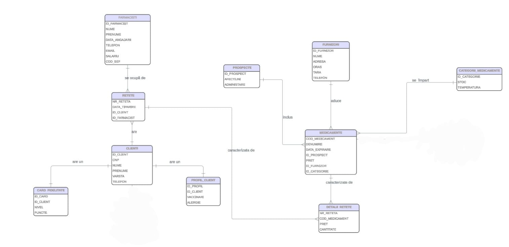

## Introducere
Această bază de date modelează activitatea unei farmacii, gestionând informații despre farmaciști, clienți, rețete, medicamente, furnizori și categorii de medicamente.
Un client poate avea mai multe rețete, iar fiecare rețetă este procesată de un farmacist și poate conține mai multe medicamente. Relația dintre rețete și medicamente este implementată prin entitatea intermediară DetaliiReteta, care păstrează informații suplimentare precum cantitatea și prețul.
Medicamentele sunt furnizate de furnizori și organizate în categorii, iar fiecare client poate avea un profil și un card de fidelitate. Modelul reflectă structura reală a unei farmacii și asigură o organizare coerentă a datelor.

## Diagrama ER

## Documentația Modelului de Date

### Entități

FARMACISTI
Reprezintă angajații farmaciei care se ocupă de procesarea rețetelor și eliberarea medicamentelor către clienți.

CLIENTI
Reprezintă persoanele care vin la farmacie cu o rețetă și pot beneficia de servicii precum profil de client sau card de fidelitate.

RETETE
Reprezintă rețetele aduse de clienți la farmacie și procesate de farmaciști.

CARD_FIDELITATE
Reprezintă cardul de fidelitate pe care un client îl poate avea pentru a acumula puncte în urma achizițiilor.

PROFIL_CLIENT
Reprezintă profilul medical al clientului, în care pot fi stocate informații despre vaccinări și alergii.

FURNIZORI
Reprezintă furnizorii care livrează medicamente către farmacie.

CATEGORII_MEDICAMENTE
Reprezintă categoriile din care fac parte medicamentele.

MEDICAMENTE
Reprezintă produsele farmaceutice disponibile în farmacie.

PROSPECTE
Reprezintă prospectele asociate medicamentelor, care conțin informații despre administrare și afecțiunile pentru care sunt recomandate.

DETALII_RETETE
Reprezintă detaliile unei rețete și stabilește legătura dintre rețete și medicamente, incluzând informații precum cantitatea și prețul.

 ### Relațiile dintre entități

CLIENTI – RETETE
Un client poate avea mai multe rețete, însă o rețetă aparține unui singur client. Relația este de tip one-to-many (1:N).

RETETE – DETALII_RETETE
O rețetă poate avea mai multe detalii, fiecare reprezentând un medicament din rețetă. Relația este one-to-many (1:N).

FARMACISTI – RETETE
Un farmacist poate procesa mai multe rețete, însă fiecare rețetă este procesată de un singur farmacist. Relația este one-to-many (1:N).

CLIENTI – CARD_FIDELITATE
Un client poate avea cel mult un card de fidelitate. Relația este de tip one-to-one (1:1).

CLIENTI – PROFIL_CLIENT
Un client poate avea un profil medical asociat. Relația este one-to-one (1:1).

FURNIZORI – MEDICAMENTE
Un furnizor poate livra mai multe medicamente, însă fiecare medicament este furnizat de un singur furnizor. Relația este one-to-many (1:N).

CATEGORII_MEDICAMENTE – MEDICAMENTE
O categorie poate conține mai multe medicamente, însă fiecare medicament aparține unei singure categorii. Relația este one-to-many (1:N).

PROSPECTE – MEDICAMENTE
Un prospect poate fi asociat mai multor medicamente, însă fiecare medicament are un singur prospect. Relația este one-to-many (1:N).

RETETE – MEDICAMENTE
Relația dintre rețete și medicamente este de tip many-to-many (M:N) și este implementată prin entitatea DETALII_RETETE, care conține informații suplimentare despre medicamentele dintr-o rețetă.

## Operatii CRUD

Pentru toate entitatile principale au fost implementate operatii CRUD folosind Spring Data JPA.

Arhitectura aplicatiei include:
- Controller layer pentru expunerea API-urilor REST
- Service layer pentru logica de business
- Repository layer folosind JpaRepository
- Exception handling global pentru tratarea erorilor

Endpoint-urile au fost testate folosind Postman.

## Configurare Multi-Environment
Proiectul utilizează două profile Spring pentru gestionarea mediilor:

dev
- baza de date: PostgreSQL
- configurare în application-dev.yml
- utilizată pentru dezvoltare

test
- baza de date: H2 in-memory
- configurare în application-test.yml
- utilizată pentru testare rapidă

Profilul activ se setează prin:
spring.profiles.active=dev
sau
spring.profiles.active=test

### Testing

Proiectul include unit tests și integration tests pentru verificarea funcționalităților aplicației.

Unit Tests

Testele unitare sunt implementate folosind JUnit 5 și Mockito și verifică logica din service layer prin simularea repository-urilor.

Code coverage pentru service este 76%.

Integration Tests

Au fost implementate 4 scenarii end-to-end folosind @SpringBootTest:

Client → Card Fidelitate;
Client → Profil Client;
Client + Farmacist → Rețetă;
Categorie + Prospect + Furnizor → Medicament

Test Database

Integration tests folosesc profilul test, configurat cu baza de date H2 in-memory în application-test.yml, pentru rularea rapidă și izolată a testelor.
